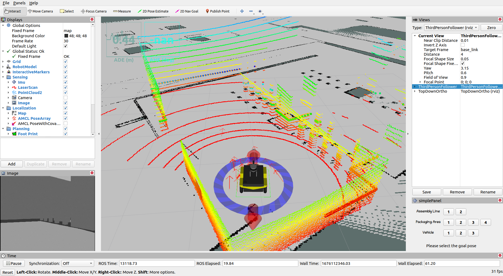
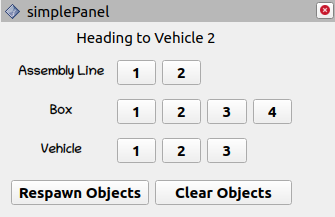
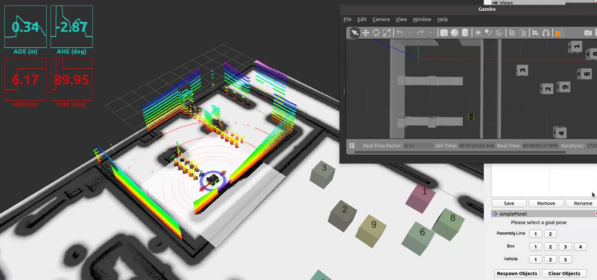
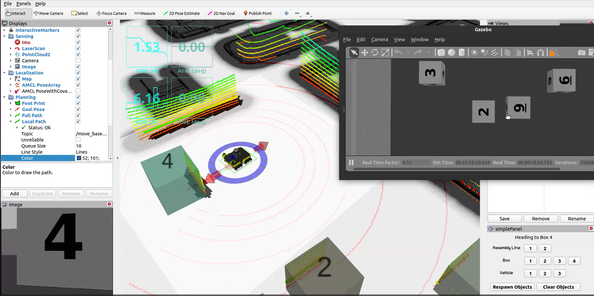
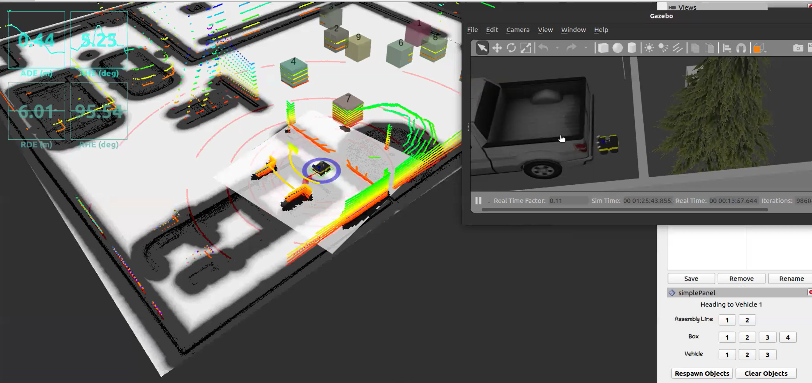

# Autonomous_Mobile_Robotics_Navi

This repository is the implementation for ME5413 Autonomous Mobile Robotics Final Project Navigation Part.
>Created by Final Group 3

For task requirements and details, please refer to (https://github.com/NUS-Advanced-Robotics-Centre/ME5413_Final_Project)

## Dependencies


### Others:
  * `pcl_ros` is used for generating pcl file from rostopic
  * `teb_local_planner` is used for local path plan, you need use the following command to install this package:
  ```bash
  sudo apt-get install ros-noetic-teb-local-planner
  pip/conda install dependencies in `box_goal.py`(mobile_final/src/me5413_world/)
  ```
## Installation
This repo is a ros workspace, containing several rospkgs:
* `costmap_prohibition_layer` provides a plugin to add virtual obstacle in costmap to set prohibited region
* `interactive_tools` are customized tools to interact with gazebo and your robot
* `jackal_description` contains the modified jackal robot model descriptions
* `jackal_navigation` contains a probabilistic localization system for navigation
* `me5413_world` the main pkg containing the gazebo world, and the launch files
* `pcd2pgm` for converting pcd file to pgm map which can be used for navigation
```bash

# Clone this repo
git clone https://github.com/YUJ0E/Autonomous_Mobile_Robotics_Navigation.git
cd mobile_final


# Install all dependencies
rosdep install --from-paths src --ignore-src -r -y

# Build
catkin_make
# Source 
source devel/setup.bash
```
To properly load the gazebo world, you will need to have the necessary model files in the `~/.gazebo/models/` directory, which installation instructions can be found in URL above.
## Usage
```bash
# Launch Gazebo World together with our robot
```bash
source devel/setup.bash
roslaunch me5413_world world.launch
```


Then run the `box_goal.py` of mobile_final/src/me5413_world/scripts/box_goal.py in sync environment

In the second terminal launch the navigation node
```bash
source devel/setup.bash
roslaunch me5413_world navigation.launch
```


In Rviz you could choose `teb_global_planner` in full path and choose `teb_local_planner` in local path.

Click the buttons of the bottom right panel in rviz and navigation to the specified pose


To navigate to the boxes, you need to click Respawn Objects first.

The required results (assembly line 2; box 4; vehicle 1) of our group are shown below:





## License

The [Autonomous_Mobile_Robotics_Navigation](https://github.com/YUJ0E/Autonomous_Mobile_Robotics_Navigation) is released under the [MIT License]
